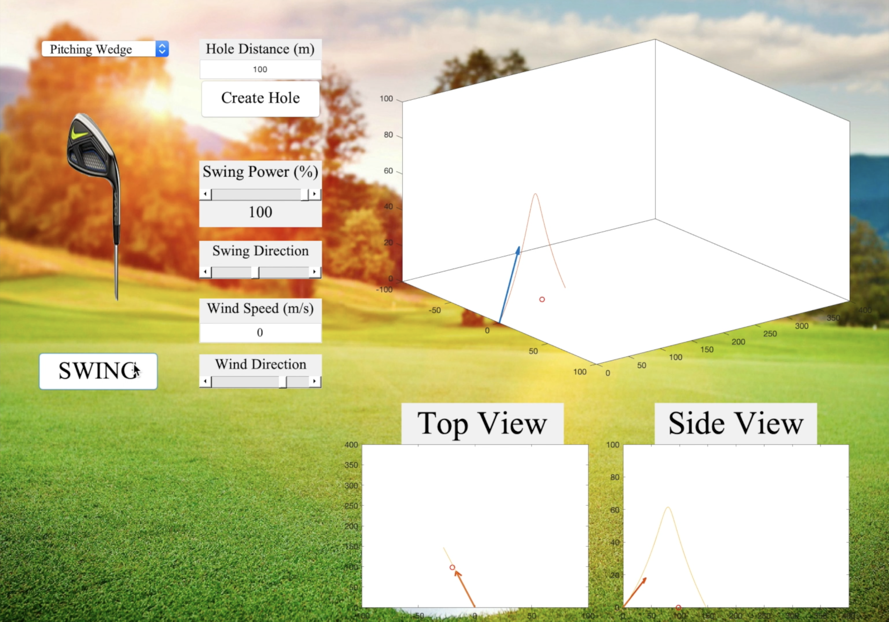

## Golf Simulator

This MATLAB GUI allows a user to select a variety of inputs such as club type, wind speed and direction, swing direction, swing power, and hole distance to see the dynamics of a golf ball with different parameters. The results of each swing are plotted in multiple views.

